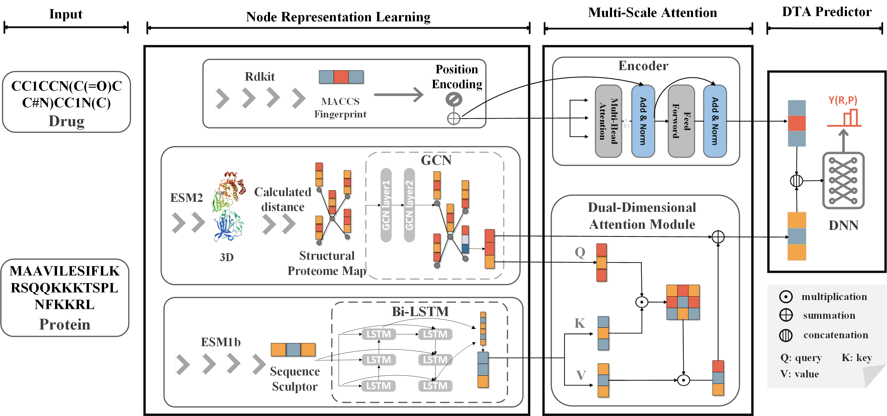

# MPA-DTA



**This is the data and code for our paper** `MPA-DTA: Predicting drug-target affinity with multi-scale protein-based attention mechanisms`.

## Prerequisites

Make sure your local environment has the following installed:

* `cuda version > 11.2`
* `pytorch>=2.0.0`
* `python == 3.9 or 3.10`

## Datasets

We provided the dataset:

1. `data/davis_test.csv`
2. `data/davis_train.csv`
3. `data/kiba_test.csv`
4. `data/kiba_train.csv`

`proteins_davis.txt`&`proteins_kiba.txt` is used to prepare 1D and 2D proteins

#### Specific steps

First you need to make the 1D protein

```
python datahelper.py
```

Then you need to generate a 3D protein map using ESM2

Finally, the 3D protein map is converted to 2D

```
python 3Dto2D.py
```

## Documentation

```
│--README.md
│--3Dto2D.py
│--datahelper.py
│--process_smiles.py
│--training.py

--src
    │--getdata.py
    │--utils.py
    --models
    │--cvae_models.py
    │--DAT.py
    │--layers.py
    │--transformer.py
  
--data
    │--davis_test.csv
    |--davis_train.csv
    |--kiba_test.csv
    |--kiba_train.csv
    |--proteins_davis.txt
    |--proteins_kiba.txt
```

## Train

```
python training.py
```

## Authors

**Shengbo Fu** @github.com/20191864241 \
**Email:** 305105281@qq.com \
**Site:** [GitHub](https://github.com/Cheng0829)
